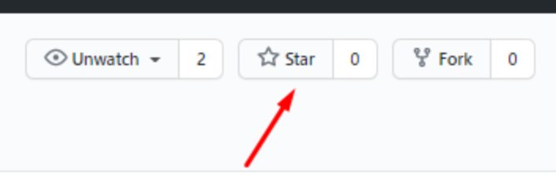

  

# Hi! I'm readme file and will tell you about this project.
___
Do you love test UI? No?! Why? Because it's **slowly** and **unstability**.

Okey-dokey, let's start testing API.

The project shows how you can test API by using the library `Rest-assured`.

## Acknowledgements
___
[Vasenkov Stanislav](https://github.com/svasenkov)

[Maintenance and technical support website https://reqres.in/](https://reqres.in/)

## About the hometask
___
1. Разработайте 5 автотестов на запросы из https://reqres.in/
2. Дайте код на ревью коллегам из своей группы. После ревью они должны поставить вашему репозиторию звездочку. 
 
**Note:** сдаче принимается дз с минимум 2мя звездами:

## Steps
___
1. Created a structure of the project: created files .gitignore, build.gradle and me, directories.
2. Creaded several tests by lesson video (package `example`).
3. Created package 'ru.zenicko.reqres' and test class `ReqresTests`.
4. Created 5 tests
   1. List users `/api/users?page=2`: check status code.
   2. Single user `/api/users/<n>`: check a value `<n>` of a field `id` response.
   3. Single user `/api/users/<n>`: check existing field.
   4. Single <resource> not found `/api/unknown/23`: check body is empty.
   5. Create `/api/users`: validation response JSON by schema.json.

## Resources
___
1. [Site the library `Rest-assured`](https://rest-assured.io/)
2. [The test stand](https://reqres.in/)
3. [URL status Selenoid site](https://selenoid.autotests.cloud/status)
4. [Status codes of HTTP response](https://bertal.ru/)
5. [Framework Hamcrest](http://hamcrest.org/JavaHamcrest/tutorial)
6. JSON
   1. [Как проверить JSON-объект в Java?](https://overcoder.net/q/714825/%D0%BA%D0%B0%D0%BA-%D0%BF%D1%80%D0%BE%D0%B2%D0%B5%D1%80%D0%B8%D1%82%D1%8C-json-%D0%BE%D0%B1%D1%8A%D0%B5%D0%BA%D1%82-%D0%B2-java)

## Miscellaneous
1. [REST Assured: что мы узнали за пять лет использования инструмента](https://habr.com/ru/company/dins/blog/464225/)
2. [A self-contained hamcrest jar containing all of the sub-modules in a single artifact.](https://mvnrepository.com/artifact/org.hamcrest/hamcrest-all)
